# Timeline — архитектура решения

Сервис долгосрочного планирования работ на команду.

Документ описывает целевую архитектуру: декомпозицию на микросервисы, модель данных,
межсервисное взаимодействие, обеспечение консистентности, безопасность, наблюдаемость
и план реализации.

---

## Содержание

1. [Задача и границы решения](#1-задача-и-границы-решения)
2. [Домен и словарь терминов](#2-домен-и-словарь-терминов)
3. [Декомпозиция на сервисы](#3-декомпозиция-на-сервисы)
4. [C4: контекст](#4-c4-контекст)
5. [C4: контейнеры](#5-c4-контейнеры)
6. [C4: развёртывание](#6-c4-развёртывание)
7. [Модель данных](#7-модель-данных)
8. [Доменные алгоритмы](#8-доменные-алгоритмы)
9. [Межсервисное взаимодействие](#9-межсервисное-взаимодействие)
10. [Консистентность данных](#10-консистентность-данных)
11. [Saga: распределённые транзакции](#11-saga-распределённые-транзакции)
12. [Аутентификация и авторизация](#12-аутентификация-и-авторизация)
13. [API Gateway и BFF](#13-api-gateway-и-bff)
14. [Кэширование, шардинг, репликация](#14-кэширование-шардинг-репликация)
15. [Наблюдаемость и обработка ошибок](#15-наблюдаемость-и-обработка-ошибок)
16. [Нагрузочное тестирование](#16-нагрузочное-тестирование)
17. [Пользовательские сценарии и API](#17-пользовательские-сценарии-и-api)
18. [Технологический стек](#18-технологический-стек)
19. [План реализации](#19-план-реализации)
20. [Реестр архитектурных решений (ADR)](#20-реестр-архитектурных-решений-adr)
21. [Риски](#21-риски)

---

## 1. Задача и границы решения

### Что решаем

Команда разработки планирует работы на горизонт нескольких месяцев. Нужен инструмент,
который отвечает на вопросы:

- какие задачи в каком спринте выполняются и силами каких ролей;
- хватает ли ёмкости конкретной роли в конкретном спринте с учётом отпусков;
- что произойдёт с планом, если одна задача сдвинется;
- где план уже нереалистичен.

Основной экран — таблица: строки это задачи, сгруппированные по эпикам; колонки это
спринты; в шапке колонки — доступная и занятая ёмкость по ролям; в ячейке — объём
работ роли по задаче в этом спринте.

### Вне области

- Мультикомандность и кросс-командное планирование.
- What-if сценарии и сравнение версий плана (поле `plan_version_id` заложено в схему,
  функциональность отложена).
- Двусторонняя синхронизация с Jira: направление только Jira → Timeline.
- Учёт фактических трудозатрат (timesheets). Система планирует, но не фиксирует факт.

---

## 2. Домен и словарь терминов

Два разных понятия в русском языке называются словом «роль». В коде и API они
разведены жёстко:

| Термин | Значение | Владелец |
|---|---|---|
| **SystemRole** | Роль в приложении: `ADMIN`, `MEMBER` | Keycloak |
| **Discipline** | Профессиональная роль: backend, frontend, QA, аналитик | `team-service` |

Остальные термины:

| Термин | Значение                                                              |
|---|-----------------------------------------------------------------------|
| **TeamMember** | Сотрудник команды: дисциплина, период активности, отпуска             |
| **Vacation** | Отпуск сотрудника, интервал дат                                       |
| **Sprint** | Итерация с датами начала и конца; единица времени планирования        |
| **WorkingCalendar** | Производственный календарь: выходные, праздники, переносы             |
| **Velocity** | Производительность одного сотрудника дисциплины, SP на рабочий день   |
| **Epic** | Контейнер задач, единица группировки строк таблицы                    |
| **Task** | Задача; имеет оценки по задействованным дисциплинам                   |
| **TaskEstimate** | Оценка задачи для одной дисциплины, в SP                              |
| **TaskLink** | Связь между задачами: тип, без временных лагов                        |
| **Allocation** | Плановый объём работ: задача × спринт × дисциплина × SP               |
| **Capacity** | Доступная ёмкость дисциплины в спринте, SP. Вычисляется     |
| **Conflict** | Обнаруженное нарушение плана: перегруз, нарушенная связь и т.п.     |
| **Board** | Read-model основного экрана, денормализованная проекция               |

### Ключевые доменные решения

**Оценка задачи — вектор по дисциплинам.** Администратор указывает задействованные
роли и оценку в SP по каждой из них. Набор строк `TaskEstimate` и есть перечень
задействованных ролей: появление строки означает, что роль участвует, удаление — что
нет.

**Единица измерения работ — story points.** В SP выражены оценки, аллокации и ёмкость
спринта. Отсюда три следствия, заложенные в модель:

- нужна **velocity по дисциплине** — сколько SP один её сотрудник закрывает за
  рабочий день; без неё отпуска, измеряемые в днях, не пересчитать в SP;
- **focus factor не применяется**: velocity калибруется по реальным спринтам, где
  встречи и поддержка уже учтены, и отдельный коэффициент дал бы двойной учёт;
- **SP разных дисциплин несопоставимы**, поэтому ёмкость и загрузка считаются и
  показываются только в разрезе дисциплины и никогда не суммируются между ними.

**Занятость сотрудника полная**, коэффициента ставки в модели нет. Доступность
снижают только отпуска и производственный календарь.

**Единица времени планирования — спринт, а не день.** Связи между задачами не имеют
лагов: они выражают порядок или совместность. Это позволяет обойтись топологической
сортировкой вместо планировщика критического пути.

**Даты задачи не хранятся, а выводятся** из множества её аллокаций. Один источник
истины исключает рассинхронизацию между «сроками задачи» и «содержимым спринтов».

**Ёмкость не хранится как вводимое значение, а вычисляется** из состава команды,
отпусков и производственного календаря. Любое сохранённое значение устарело бы при
первом же изменении отпуска.

**Перегруз ёмкости — предупреждение, а не запрет.** Руководитель осознанно
перегружает спринт и затем режет объём. Это решение имеет прямое архитектурное
следствие: кросс-сервисный инвариант «не превышаем ёмкость» не является инвариантом,
поэтому в основном потоке не нужны ни синхронные проверки, ни компенсации.

**Отпуск сотрудника не может быть отклонён из-за плана.** При изменении отпуска
план не откатывается, а пересчитывается, и расхождение отображается как конфликт.

---

## 3. Декомпозиция на сервисы

### Метод

Применены два метода с последующей сверкой результатов.

**Разбиение по агрегатам.** ER-модель склеена в агрегаты по признаку общей
транзакционной границы и общего жизненного цикла. Отпуск не имеет смысла вне
сотрудника, поэтому входит в агрегат `TeamMember`. Оценки не имеют смысла вне
задачи, поэтому входят в агрегат `Task`.

**Разбиение по бизнес-возможностям.** Выделены возможности: управление составом
команды и её доступностью, управление содержанием работ, ведение календаря итераций,
раскладка работ по итерациям.

**Сверка через event storming.** Доменные события сгруппировались в четыре кластера
(`VacationScheduled`, `TaskEstimated`, `SprintRescheduled`, `AllocationChanged`),
совпадающие с границами, полученными двумя предыдущими методами. Совпадение
результатов трёх независимых методов — основной аргумент в пользу выбранных границ.

### Результат

| Сервис | Бизнес-возможность | Агрегаты | Тип | Сложность |
|---|---|---|---|---|
| `team-service` | Состав команды и доступность | `TeamMember` (+отпуска), `Discipline` | Supporting | низкая |
| `backlog-service` | Содержание работ | `Epic`, `Task` (+оценки в SP), `TaskLink` | Supporting | средняя |
| `schedule-service` | Календарь итераций | `Sprint`, `WorkingCalendar` | Generic | низкая |
| `planning-service` | **Раскладка работ по итерациям** | `PlanVersion`, `Allocation`, `Conflict` | **Core** | высокая |
| `timeline-bff` | Чтение доски | read-model `Board` | — | средняя |
| `api-gateway` | Единая точка входа | — | — | низкая |

## 4. C4: контекст

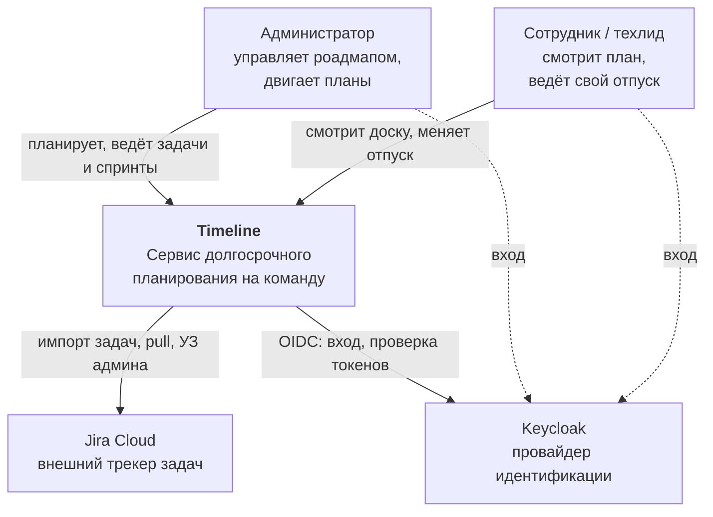

**Границы владения данными с Jira.** Jira владеет идентификатором, названием,
статусом, эпиком и описанием задачи. Timeline владеет оценками по дисциплинам,
связями для планирования и аллокациями — этих полей в Jira нет. Обратная
запись отсутствует, поэтому конфликтов слияния не возникает.

Интеграция с Jira опциональна: задачи можно заводить вручную. Недоступность Jira не
блокирует ни один пользовательский сценарий.

---

## 5. C4: контейнеры

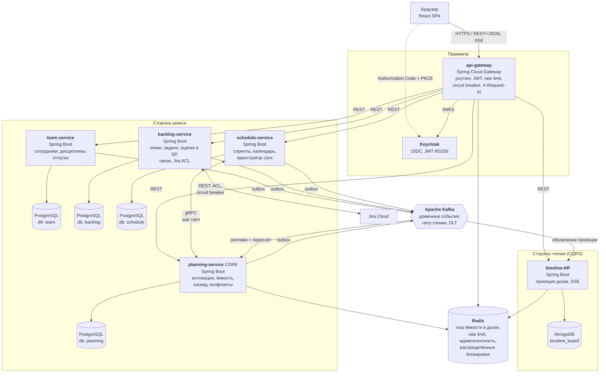

Правило взаимодействия: **команды передаются синхронно, факты — асинхронно**.
Синхронных межсервисных вызовов в пользовательском горячем пути нет по дизайну;
единственный синхронный межсервисный вызов — шаг саги удаления. Именно это защищает
систему от превращения в распределённый монолит.

---

## 6. C4: развёртывание

Целевая среда демонстрации — один хост, Docker Compose.

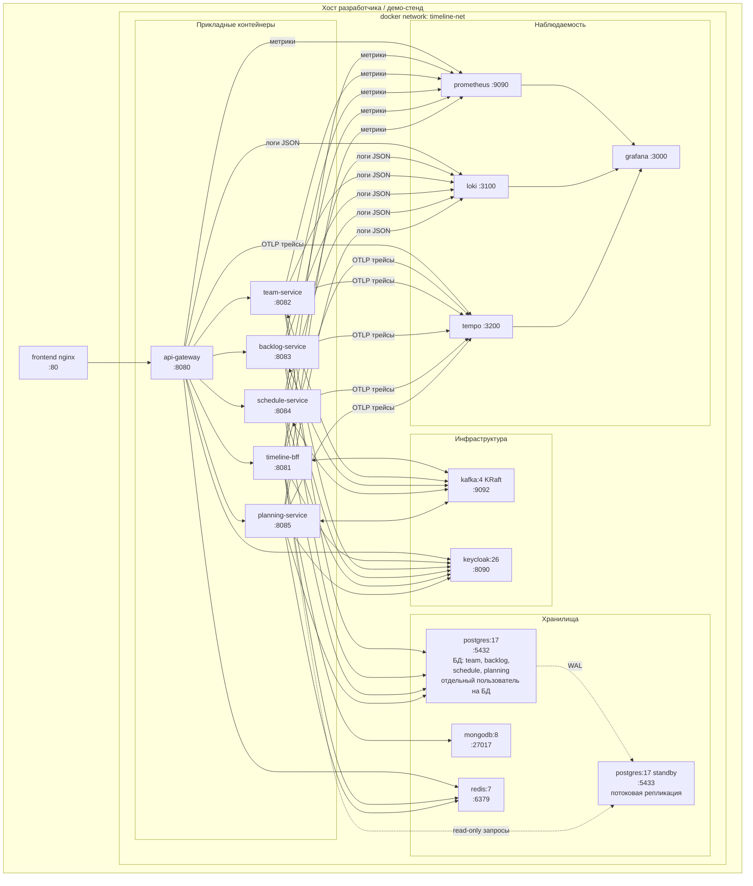

**Изоляция БД.** Физически один инстанс PostgreSQL, логически — четыре базы с
отдельными пользователями без прав доступа к чужим схемам. Это сохраняет принцип
database-per-service (кросс-сервисные запросы невозможны на уровне прав) при
адекватном для одного разработчика потреблении ресурсов. Переход к отдельным
инстансам — изменение строки подключения.

**Kubernetes/Helm** не используются: цель проекта не в демонстрации оркестрации,
а сложность эксплуатации для одного разработчика выросла бы непропорционально.

---

## 7. Модель данных

### 7.1 team-service

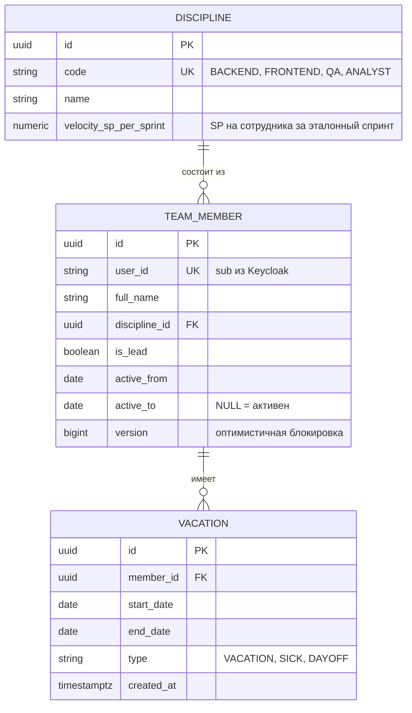

Отпуска входят в агрегат `TeamMember`: у отпуска нет жизненного цикла вне сотрудника,
и транзакционная граница совпадает.

`velocity_sp_per_sprint` вводится администратором в удобной форме — сколько SP один
сотрудник закрывает за эталонный спринт (длина эталона задаётся глобально, например
10 рабочих дней). Внутри система пересчитывает её в SP на рабочий день, что
обеспечивает корректную ёмкость для спринтов разной длины и праздничных периодов.

### 7.2 schedule-service

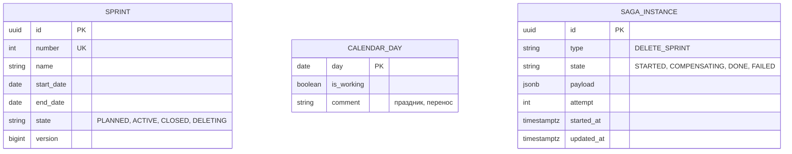

Состояние `DELETING` используется сагой удаления спринта (см. раздел 11).

### 7.3 backlog-service

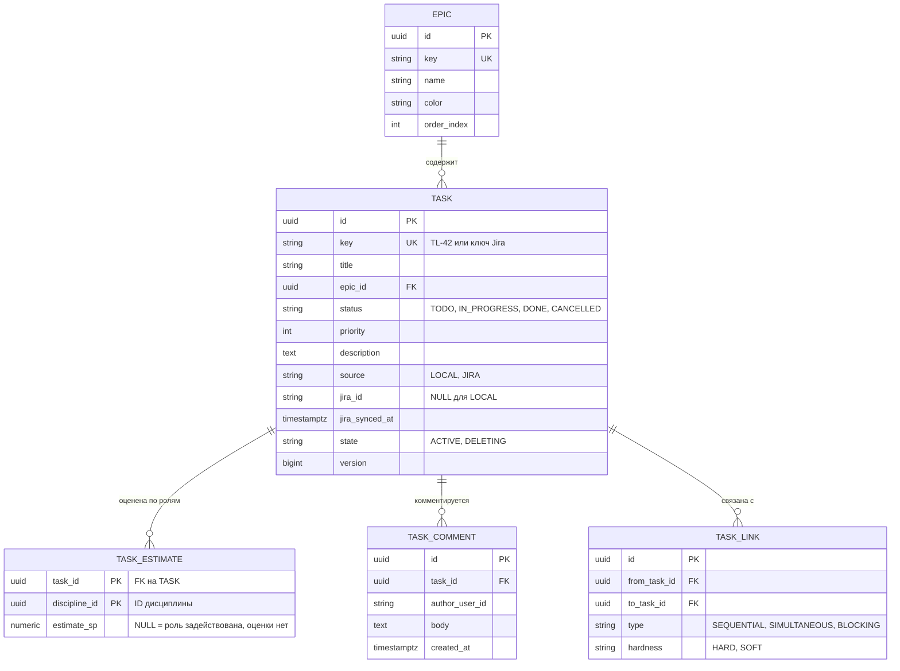

`TASK_ESTIMATE` с составным ключом `(task_id, discipline_id)` задаёт одновременно
перечень задействованных ролей и оценку по каждой. Строка с `estimate_sp = NULL`
означает «роль участвует, оценка ещё не дана»: такое состояние допустимо и
подсвечивается конфликтом `MISSING_ESTIMATE`, а не блокирует сохранение задачи.

#### Типы связей между задачами

Пользователь формулирует связи пятью способами, но три из них — одно отношение,
записанное с разных концов. Хранятся три типа с канонизированным направлением
`from → to`, без лагов и любых указаний в днях:

| Формулировка в интерфейсе | Хранится как | Ограничение на план |
|---|---|---|
| «делать после A», «ставим после A» | `SEQUENTIAL`, A → B | `firstSprint(B) > lastSprint(A)` |
| «делать до B» | `SEQUENTIAL`, A → B, концы переставлены | то же самое |
| «ставим вместе с A» | `SIMULTANEOUS`, A ↔ B | `sprints(A) = sprints(B)` |
| «A блокирует B» | `BLOCKING`, A → B | `firstSprint(B) > lastSprint(A)` и B нельзя переводить в работу, пока A не `DONE` |

`hardness` отделяет логическую необходимость от предпочтения планировщика:
**`HARD`** — нарушение невозможно физически, связь участвует в каскадном пересчёте,
нарушение даёт `ERROR`; **`SOFT`** — пожелание порядка, план не двигает, нарушение
даёт `WARNING`. `BLOCKING` всегда `HARD`: помимо порядка спринтов он вводит статусное
правило, поэтому остаётся единственным типом связи, влияющим на план уже после начала
спринта.

`SIMULTANEOUS` — ненаправленное отношение, образующее группы задач, планируемых в одни
и те же спринты. Оно добавляет инвариант, проверяемый вместе с ацикличностью:
**внутри одной группы совместности не может быть направленной связи**. Комбинация
«A вместе с B» и «A после B» логически неразрешима и отклоняется при вводе, а не
всплывает неустранимым конфликтом в плане.

### 7.4 planning-service

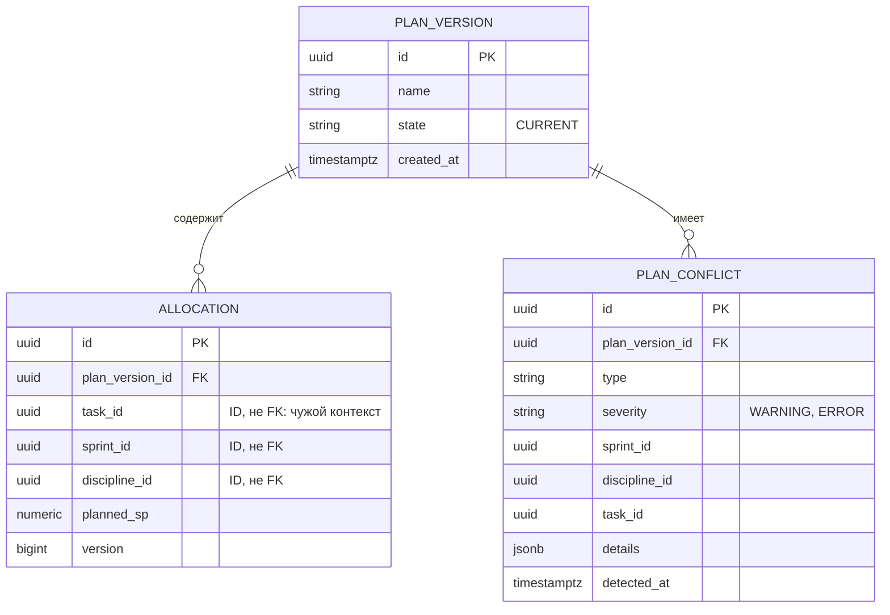

Между контекстами используются идентификаторы, а не внешние ключи. Ссылочная
целостность через границу сервиса обеспечивается сагами удаления, а не СУБД.

Реплики чужих данных, наполняемые событиями (Event-Carried State Transfer):

```mermaid
erDiagram
    REF_MEMBER {
        uuid id PK
        uuid discipline_id
        date active_from
        date active_to
        timestamptz updated_at
    }
    REF_DISCIPLINE {
        uuid id PK
        string code
        numeric velocity_sp_per_day
    }
    REF_VACATION {
        uuid id PK
        uuid member_id
        date start_date
        date end_date
    }
    REF_SPRINT {
        uuid id PK
        int number
        date start_date
        date end_date
        int working_days "с учётом календаря"
    }
    REF_TASK {
        uuid id PK
        string key
        string title
        uuid epic_id
        string status
    }
    REF_TASK_ESTIMATE {
        uuid task_id PK
        uuid discipline_id PK
        numeric estimate_sp
    }
    REF_TASK_LINK {
        uuid id PK
        uuid from_task_id
        uuid to_task_id
        string type
        string hardness
    }
    SPRINT_CAPACITY {
        uuid sprint_id PK
        uuid discipline_id PK
        numeric available_person_days "с вычетом отпусков"
        numeric vacation_person_days "для объяснения снижения"
        numeric capacity_sp
        timestamptz calculated_at
    }
```

`SPRINT_CAPACITY` — материализованный результат расчёта, кэш, а не источник истины.
Пересчитывается по событиям и может быть в любой момент восстановлен из реплик.

### 7.5 Общие технические таблицы

Присутствуют в каждом сервисе, публикующем или потребляющем события:

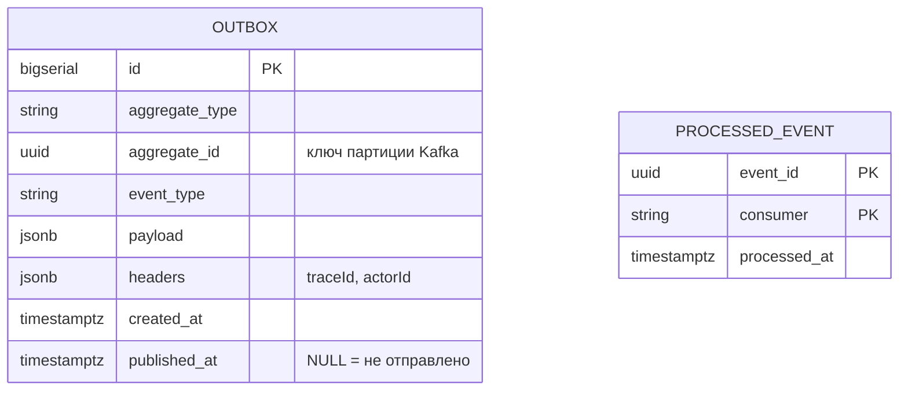

Обе таблицы партиционированы по времени (`PARTITION BY RANGE (created_at)`): они
растут линейно и очищаются отбрасыванием партиций, а не операцией `DELETE`.

### 7.6 timeline-bff: read model

MongoDB, один документ на доску. Форма документа повторяет форму экрана, поэтому
отрисовка требует одного чтения по `_id` и не содержит соединений.

```json
{
  "_id": "board:current",
  "updatedAt": "2026-09-20T07:40:00Z",
  "lastEventOffset": 148223,
  "sprints": [
    {
      "id": "...", "number": 12, "startDate": "2026-09-07", "endDate": "2026-09-20",
      "workingDays": 10,
      "capacity": [
        { "discipline": "BACKEND", "vacationPersonDays": 10, "availablePersonDays": 20,
          "capacitySp": 40, "allocatedSp": 52, "freeSp": -12, "overloaded": true },
        { "discipline": "QA",      "vacationPersonDays": 0,  "availablePersonDays": 10,
          "capacitySp": 15, "allocatedSp": 6,  "freeSp": 9,   "overloaded": false }
      ]
    }
  ],
  "epics": [
    {
      "id": "...", "key": "EP-1", "name": "Личный кабинет",
      "tasks": [
        {
          "id": "...", "key": "TL-42", "title": "API профиля",
          "status": "IN_PROGRESS", "commentsCount": 3,
          "estimates": [
            { "discipline": "BACKEND", "estimateSp": 13 },
            { "discipline": "QA", "estimateSp": 5 }
          ],
          "cells": [
            { "sprintId": "...", "discipline": "BACKEND", "plannedSp": 8,
              "conflicts": ["CAPACITY_OVERFLOW"] }
          ],
          "links": [
            { "type": "SEQUENTIAL", "hardness": "HARD", "direction": "AFTER", "taskKey": "TL-40" },
            { "type": "BLOCKING", "direction": "BLOCKS", "taskKey": "TL-55" },
            { "type": "SIMULTANEOUS", "taskKey": "TL-43" }
          ]
        }
      ]
    }
  ],
  "conflictsSummary": { "ERROR": 1, "WARNING": 11 }
}
```

`lastEventOffset` используется для контроля устаревания проекции (см. раздел 15).

---

## 8. Доменные алгоритмы

### 8.1 Расчёт ёмкости

Ёмкость выражается в SP, а отпуска — в днях, поэтому расчёт идёт в два шага: сначала
доступность в человеко-днях, затем перевод в SP через velocity дисциплины.

```
availablePersonDays(sprint, discipline) =
    Σ по сотрудникам дисциплины:
        workingDays(sprint ∩ [active_from, active_to])
      − vacationWorkingDays(сотрудник, sprint)

capacitySp(sprint, discipline) =
    velocitySpPerDay(discipline) × availablePersonDays(sprint, discipline)

где velocitySpPerDay(d) = velocitySpPerSprint(d) / referenceWorkingDays
```

Свойства формулы:

- **Производственный календарь обязателен.** «Рабочие дни спринта» нельзя считать как
  длительность минус выходные: праздники и переносы в отдельные периоды съедают до
  половины итерации.
- **Спринты разной длины обрабатываются корректно.** Нормировка velocity на рабочий
  день означает, что укороченный праздниками спринт автоматически получает меньшую
  ёмкость, без ручных поправок.
- **Focus factor отсутствует намеренно**: velocity калибруется по фактически закрытым
  спринтам, где встречи, поддержка и ревью уже учтены.
- **Коэффициента занятости нет**: занятость каждого сотрудника полная, доступность
  снижают только отпуска и календарь.

`vacationPersonDays` хранится отдельно не для расчёта, а для объяснения: он отвечает
на вопрос «почему ёмкость бэкенда в этом спринте вдвое ниже обычной» и прямо
закрывает требование видеть пересечения отпусков с потребностью в ролях.

### 8.2 Каскадный сдвиг по связям

Ограничения, налагаемые связями на план (лагов нет, всё в терминах спринтов):

```
SEQUENTIAL   A → B:  firstSprint(B) > lastSprint(A)
BLOCKING     A → B:  firstSprint(B) > lastSprint(A)  и  A должна быть DONE
                     к началу спринта B
SIMULTANEOUS A ↔ B:  sprints(A) = sprints(B)
```

Алгоритм при переносе задачи:

1. **Свернуть группы совместности.** Связи `SIMULTANEOUS` образуют классы
   эквивалентности; каждый класс объединяется в супер-узел (union-find). Это
   гарантирует, что задачи «ставим вместе» двигаются только целиком.
2. **Построить подграф достижимости** от изменённого супер-узла по рёбрам
   `SEQUENTIAL` и `BLOCKING` с `hardness = HARD` (рекурсивный CTE по
   `REF_TASK_LINK`). Рёбра `SOFT` в каскад не входят.
3. **Топологическая сортировка** подграфа.
4. **Forward pass**: для каждого узла в порядке сортировки вычислить минимально
   допустимый спринт начала; при нарушении сдвинуть все аллокации всех задач узла
   вперёд, сохраняя относительное распределение SP по спринтам и дисциплинам.
5. **Пересчитать** `SPRINT_CAPACITY` и `PLAN_CONFLICT` для затронутых спринтов и
   выпустить предупреждения по нарушенным `SOFT`-рёбрам.

Всё выполняется в одной транзакции внутри `planning-service`.

Порядок шагов важен: свёртка групп совместности **до** топологической сортировки —
единственный способ совместить два типа ограничений, не получив взаимно
противоречивых сдвигов.

**Каскад не применяется автоматически.** Перенос задачи выполняется в два шага:
`preview=true` возвращает список задач, которые сдвинутся, и появляющиеся конфликты;
`preview=false` применяет изменение. Это одновременно правильный UX (администратор не
получает неожиданных массовых правок) и упрощение архитектуры (нет длительных
неявных транзакций).

### 8.3 Детекция конфликтов

| Тип | Severity | Условие |
|---|---|---|
| `CAPACITY_OVERFLOW` | WARNING | `allocatedSp > capacitySp` для пары спринт × дисциплина |
| `SEQUENCE_VIOLATION` | ERROR / WARNING | Нарушен порядок спринтов по связи `SEQUENTIAL`: `ERROR` для `HARD`, `WARNING` для `SOFT` |
| `SIMULTANEITY_VIOLATION` | ERROR | Задачи, связанные `SIMULTANEOUS`, стоят в разных спринтах |
| `BLOCKED_TASK` | ERROR | Задача запланирована или начата, а блокирующая её задача не `DONE` |
| `VACATION_OVERLAP` | WARNING | Поимённо назначенный сотрудник в отпуске в этом спринте |
| `MISSING_ESTIMATE` | WARNING | Роль задействована в задаче, но оценка в SP не проставлена |
| `UNPLANNED_TASK` | WARNING | Задача в статусе `TODO`/`IN_PROGRESS` без аллокаций |
| `OVER_ALLOCATED_TASK` | WARNING | Сумма аллокаций задачи по дисциплине ≠ оценке в SP |

Конфликты материализуются в таблицу, а не вычисляются на каждый запрос: это позволяет
показывать сводку «11 предупреждений в плане» без обхода всего графа.

Планирование по дисциплинам обезличенное. Поимённая привязка сотрудника к аллокации
опциональна и нужна единственно для проверки `VACATION_OVERLAP`.

---

## 9. Межсервисное взаимодействие

### 9.1 Синхронное

| Направление | Протокол | Назначение |
|---|---|---|
| Браузер → gateway | REST/JSON, HTTP/1.1 | Все пользовательские операции |
| Gateway → сервис | REST/JSON | Проксирование с проброшенным JWT |
| BFF → браузер | SSE | Уведомление об обновлении доски |
| `schedule` → `planning` | **gRPC**, HTTP/2 | Шаг саги удаления спринта |

REST выбран для внешнего контура: он отлаживается браузером и Postman, документируется
через OpenAPI и не требует кодогенерации у потребителя. Версионирование через префикс
пути `/api/v1`.

gRPC применён на единственном межсервисном синхронном вызове: строгий контракт в
`.proto`, кодогенерация обеих сторон, бинарная сериализация, встроенные дедлайны. Этот
вызов не находится в пользовательском горячем пути, поэтому не создаёт связности
времени выполнения в основных сценариях.

SSE вместо поллинга: пересчёт каскада и обновление проекции асинхронны, уведомление
инициирует сервер. Для одностороннего потока сервер → клиент SSE проще WebSocket и
работает поверх обычного HTTP.

### 9.2 Асинхронное

**Брокер — Apache Kafka.** Обоснование выбора:

- Нужен **лог событий с повторным чтением**: read-model в BFF и реплики в `planning`
  должны пересобираться с нуля перечитыванием топиков. Классические очереди (RabbitMQ)
  удаляют сообщение после подтверждения и такой возможности не дают.
- Нужно **упорядочивание по агрегату**: события одной задачи обязаны применяться в
  порядке возникновения. Kafka даёт это через ключ партиции.
- Несколько независимых потребителей одного потока (`planning` и `bff`) — модель
  consumer group подходит напрямую.

RabbitMQ был бы уместнее при сложной маршрутизации и приоритетах очередей; здесь
ни того, ни другого нет.

**Ключ партиции — `aggregateId`.** Это осмысленное решение о шардировании потока:
события одного агрегата гарантированно попадают в одну партицию и сохраняют порядок.
Выбор, например, типа события в качестве ключа привёл бы к гонкам при обновлении
реплик.

### 9.3 Контракт событий

| Топик | События | Потребители |
|---|---|---|
| `team.member.v1` | `MemberJoined`, `MemberUpdated`, `MemberDeactivated` | planning, bff |
| `team.vacation.v1` | `VacationScheduled`, `VacationChanged`, `VacationCancelled` | planning, bff |
| `schedule.sprint.v1` | `SprintCreated`, `SprintRescheduled`, `SprintDeleted` | planning, bff |
| `schedule.calendar.v1` | `CalendarUpdated` | planning |
| `backlog.task.v1` | `TaskCreated`, `TaskUpdated`, `TaskEstimated`, `TaskStatusChanged`, `TaskDeleted` | planning, bff |
| `backlog.link.v1` | `TaskLinkAdded`, `TaskLinkRemoved` | planning |
| `planning.allocation.v1` | `AllocationChanged`, `PlanRecalculated` | bff |
| `planning.conflict.v1` | `ConflictDetected`, `ConflictResolved` | bff |
| `<topic>.retry`, `<topic>.dlt` | повторы и неразобранные сообщения | алертинг |

Конверт события:

```json
{
  "eventId": "01J8...",
  "eventType": "VacationScheduled",
  "version": 1,
  "occurredAt": "2026-09-20T07:40:00Z",
  "aggregateType": "TeamMember",
  "aggregateId": "6f1c...",
  "actorId": "sub-from-jwt",
  "traceId": "4bf92f3577b34da6a3ce929d0e0e4736",
  "payload": { }
}
```

`traceId` в конверте обязателен: без него асинхронная цепочка «сотрудник изменил
отпуск → пересчёт ёмкости → обновление доски» не прослеживается в трассировке.

Токены доступа через шину **не передаются**: права проверяются на входе в систему, в
событии едет только `actorId` для аудита.

Правила эволюции контракта: добавление необязательных полей — совместимое изменение;
удаление или смена смысла поля — новая мажорная версия топика (`*.v2`) с временной
двойной публикацией.

---

## 10. Консистентность данных

Три уровня, от сильного к слабому.

### 10.1 Внутри сервиса — ACID

Каскадный сдвиг затрагивает сотни аллокаций, но все они в одной БД → одна транзакция
PostgreSQL. Это основная причина, по которой `planning-service` не делится дальше.

Конкурентные изменения — оптимистичные блокировки (`@Version`) на агрегатах;
на изменяющих запросах доски — `If-Match` по ETag.

### 10.2 Между сервисами — Transactional Outbox

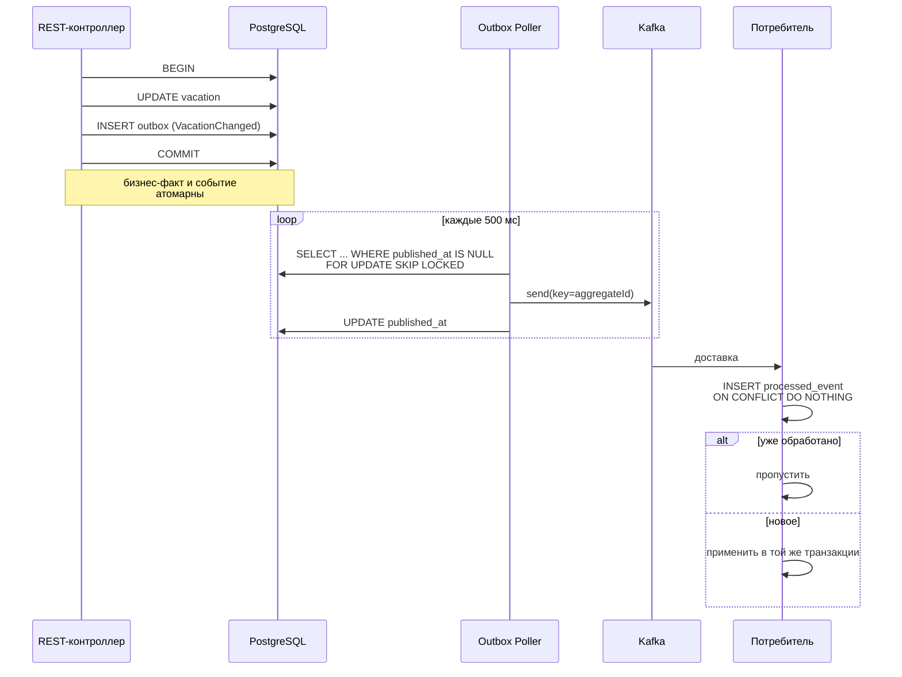

Outbox исключает классическую ошибку «запись в БД прошла, публикация упала» и
обратную. Гарантия доставки — at-least-once, поэтому все потребители идемпотентны
через таблицу `processed_event` с составным ключом `(event_id, consumer)`.

Реализация поллера — `@Scheduled` с `FOR UPDATE SKIP LOCKED`. Debezium/CDC
рассмотрен и отклонён: даёт меньшую задержку, но требует настройки логической
репликации и отдельного коннектора, что не оправдано для одного разработчика.

### 10.3 Осознанное отсутствие распределённых транзакций в основном потоке

Единственный кандидат на распределённый инвариант — «не превышаем ёмкость роли».
Данные для проверки лежат в трёх сервисах. Но по продуктовому решению перегруз
является предупреждением, а не запретом, следовательно инвариантом это не является.
Отсюда:

- проверка выполняется асинхронно на репликах внутри `planning-service`;
- результат отображается как конфликт, а не как отказ операции;
- ни синхронные проверки, ни компенсирующие действия в основном потоке не нужны.

**Отсутствие саги в основном сценарии — результат дизайна, а не недоработки.**
Если бы сага появилась в пути «добавить задачу в спринт», это означало бы ошибку
в проведении границ.

### 10.4 Восстановление согласованности

- Реплики и read-model полностью пересобираются перечитыванием топиков с начала
  (`reset offsets`), поскольку Kafka хранит лог событий, а не очередь.
- `SPRINT_CAPACITY` и `PLAN_CONFLICT` — производные данные, восстанавливаются
  пересчётом из реплик по требованию (`POST /api/v1/plan/recalculate`).
- Единственные незаменяемые данные — `ALLOCATION`, `TEAM_MEMBER`, `VACATION`,
  `SPRINT`, `TASK`, `TASK_ESTIMATE`, `TASK_LINK`. Только они требуют резервного
  копирования.

---

## 11. Saga: распределённые транзакции

Единственная форма подлинно распределённой транзакции в системе — **удаление
сущности, на которую ссылаются данные другого сервиса**. Это прямо следует из
требования «спринты: добавление, удаление, валидация» и из ссылок по ID между
контекстами.

### 11.1 Saga «Удаление спринта»

Оркестрация. Оркестратор размещён в `schedule-service` как инициаторе; состояние —
в таблице `saga_instance`.

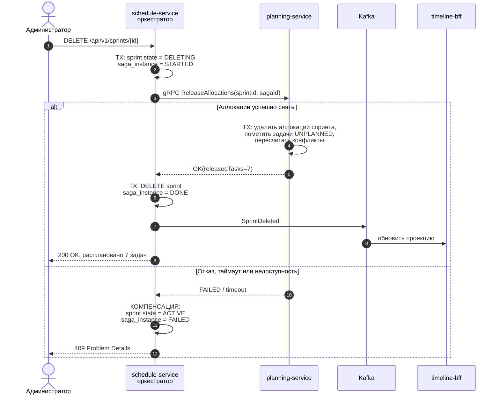

Свойства:

- шаг `ReleaseAllocations` идемпотентен по `sagaId` — безопасен при повторе;
- дедлайн gRPC-вызова 5 секунд, до трёх попыток с экспоненциальной задержкой;
- зависшие саги (`STARTED` дольше 5 минут) подхватываются фоновым восстановителем и
  компенсируются; на их количество настроен алерт;
- промежуточное состояние `DELETING` видно в API: спринт недоступен для новых
  аллокаций, пока сага не завершится.

### 11.2 Saga «Удаление задачи»

Симметрична: `backlog-service` переводит задачу в `DELETING`, вызывает
`planning-service` для снятия аллокаций, затем удаляет задачу и её связи.
Компенсация — возврат в `ACTIVE`.

### 11.3 Почему оркестрация, а не хореография

Шагов мало, порядок жёсткий, пользователю нужен синхронный ответ «удалено / не
удалено», а состояние процесса должно быть наблюдаемым. Хореография здесь сделала бы
поток неявным и усложнила диагностику.

При этом **хореография в системе тоже присутствует**: вся реакция `planning-service` и
`timeline-bff` на доменные события построена именно на ней — издатель не знает
подписчиков. То есть в проекте применены оба стиля, каждый там, где он уместен.

Внешние оркестраторы (Temporal, Camunda) рассмотрены и отклонены: две саги по два
шага не окупают отдельного движка и его эксплуатации.

---

## 12. Аутентификация и авторизация

### Схема

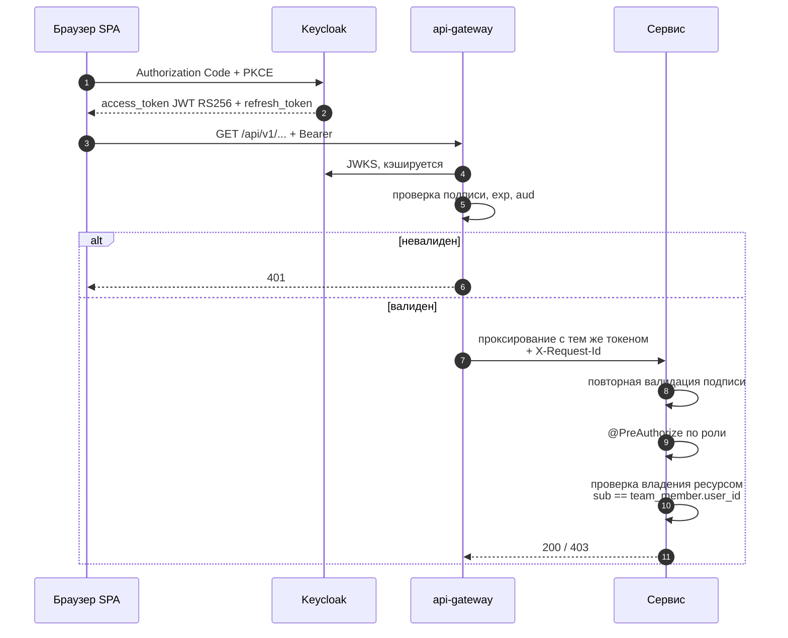

### Решения

**Провайдер идентификации — Keycloak**, realm `timeline`, роли `ADMIN` и `MEMBER` в
claim `realm_access.roles`. Собственное хранилище паролей не создаётся.

**Публичный клиент + PKCE** для SPA: клиентский секрет в браузере хранить нельзя,
PKCE защищает от перехвата кода авторизации.

**Двойная валидация токена** на gateway и в сервисе. Gateway — не единственный рубеж:
сервис не должен доверять сетевому периметру, поскольку в docker-сети он доступен
напрямую.

**Авторизация уровня ресурса — в сервисе-владельце данных.** Сотрудник редактирует
только свой отпуск, и эта проверка выполняется в `team-service` сравнением `sub` из
токена с `team_member.user_id`. Это ключевой аргумент против выделения отдельного
«сервиса авторизации»: такое правило невозможно проверить, не зная модель команды.

**Матрица доступа:**

| Операция | ADMIN | MEMBER |
|---|---|---|
| Просмотр доски, задач, спринтов, команды | да | да |
| Создание и изменение задач, оценок в SP, связей | да | нет |
| Создание, перенос и удаление спринтов | да | нет |
| Изменение аллокаций, перенос задач по спринтам | да | нет |
| Изменение состава команды и velocity дисциплин | да | нет |
| Изменение своего отпуска | да | да |
| Изменение чужого отпуска | да | **нет** |
| Запуск синхронизации с Jira | да | нет |

**Межсервисная аутентификация:** фоновые процессы (поллер outbox, синхронизация с
Jira) используют `client_credentials` с отдельным техническим клиентом. gRPC-вызов
саги защищён mTLS в пределах docker-сети либо тем же service-токеном.

**Токен Jira** (PAT администратора) хранится в `backlog-service` зашифрованным;
синхронизация выполняется фоново, а не в контексте пользовательского запроса.

---

## 13. API Gateway и BFF

### API Gateway — Spring Cloud Gateway

Используемые возможности, каждая под конкретную задачу:

| Возможность | Зачем |
|---|---|
| Маршрутизация по префиксу пути | Единая точка входа, один origin для SPA |
| Валидация JWT + кэш JWKS | Отсечение неавторизованных запросов до сервисов |
| TokenRelay | Проброс токена вниз без переупаковки |
| Rate limiting на Redis | Защита от цикла в UI и от случайного шторма запросов |
| Circuit breaker (Resilience4j) | Быстрый отказ при недоступности сервиса |
| Retry только для идемпотентных GET | Сглаживание сетевых сбоев без риска дублей |
| Единая конфигурация CORS | Иначе настройка дублируется в пяти сервисах |
| Генерация `X-Request-Id` / `traceparent` | Сквозная корреляция логов и трейсов |
| Агрегированная страница OpenAPI | Один Swagger UI на систему |

### Service Mesh не используется

Istio или Linkerd дали бы mTLS, повторы и телеметрию без изменения кода. Но при шести
контейнерах, одном разработчике и отсутствии Kubernetes в эксплуатации операционная
сложность несоразмерна выгоде. Те же задачи закрыты: mTLS — в пределах изолированной
docker-сети и на единственном gRPC-вызове, повторы и circuit breaker — Resilience4j,
телеметрия — OpenTelemetry-агент. Это осознанный отказ, а не упущение.

### BFF отдельно от gateway

Gateway инфраструктурен и не знает домен. BFF доменный: он знает форму конкретного
экрана и владеет проекцией. Смешивание внесло бы бизнес-логику в инфраструктурный
слой и сделало бы gateway зависимым от доменных изменений.

`timeline-bff` совмещает две роли — агрегация для клиента и сторона чтения CQRS.
Совмещение сознательное: единственный потребитель проекции — этот же экран, а
отдельный `timeline-query` добавил бы сетевой переход без независимого потребителя.
Компромисс зафиксирован в ADR-009.

---

## 14. Кэширование, шардинг, репликация

### Кэширование

| Уровень | Технология | Что кэшируется | Инвалидация |
|---|---|---|---|
| Распределённый | Redis | `capacity:{sprintId}` | по событиям отпусков и переносов спринтов |
| Распределённый | Redis | `board:{planId}` + ETag, ответ `304` | по `AllocationChanged`, `ConflictDetected` |
| Распределённый | Redis | ключи `Idempotency-Key` | TTL 24 часа |
| Распределённый | Redis | распределённая блокировка пересчёта | по завершении пересчёта |
| Локальный | Caffeine | дисциплины, производственный календарь | TTL 1 час + событие |
| Локальный | Caffeine | JWKS на gateway | по TTL провайдера |

Инвалидация **событийная, а не по TTL**: TTL дал бы либо устаревшую доску, либо
лишние пересчёты. Распределённая блокировка нужна для схлопывания пачки событий:
десять изменений подряд не должны запускать десять полных пересчётов, вместо этого
применяется debounce с окном в несколько секунд.

### Шардинг

**Шардинг реляционных БД не применяется.** Весь объём данных одной команды за год —
единицы мегабайт; шардирование дало бы только цену без выгоды. Осмысленное
шардирование в системе есть в двух местах:

- **Партиции Kafka по `aggregateId`** — это настоящее решение о разделении потока,
  влияющее на корректность: оно гарантирует порядок событий в пределах агрегата.
- **Декларативное партиционирование PostgreSQL по времени** для `outbox` и
  `processed_event` — единственные линейно растущие таблицы; очистка выполняется
  отбрасыванием партиции, а не `DELETE` с последующим `VACUUM`.

### Репликация

Термин применяется в двух смыслах, и в системе присутствуют оба:

**Логическая репликация между сервисами** (основной механизм). `planning-service`
держит read-only копии сотрудников, отпусков, спринтов, календаря, задач, оценок и
связей, наполняемые событиями. Именно это позволяет полностью убрать синхронные
межсервисные вызовы из горячего пути.

**Физическая репликация PostgreSQL** (демонстрационная). Primary + hot standby с
потоковой репликацией; read-only запросы BFF при необходимости направляются на
реплику. Для текущей нагрузки не требуется; включена в compose как иллюстрация схемы
масштабирования чтения и точка восстановления.

---

## 15. Наблюдаемость и обработка ошибок

### Метрики: Micrometer → Prometheus → Grafana

| Группа | Показатели |
|---|---|
| RED по сервисам | rate, errors, latency p50/p95/p99 на эндпоинт |
| JVM и пулы | heap, GC, живые потоки, HikariCP active/pending |
| Kafka | лаг консьюмер-групп, скорость обработки, размер DLT |
| Outbox | число неопубликованных записей, возраст самой старой |
| Saga | активные, зависшие, скомпенсированные |
| Домен | длительность пересчёта каскада, число конфликтов в плане, число задач без оценок |
| Проекция | **лаг read-model**: возраст последнего применённого события |

### Алерты по симптомам

| Условие | Почему это важно |
|---|---|
| Доля 5xx > 1% за 5 минут | Базовый индикатор отказа |
| p99 запроса доски > 1 с | Деградация основного сценария |
| Лаг консьюмера > 1000 или растёт 10 минут | Потребитель не справляется |
| В DLT появилось хоть одно сообщение | Событие потеряно для проекции |
| Запись в outbox не опубликована > 60 с | Поллер встал, факты не расходятся |
| Сага в состоянии `STARTED` > 5 минут | Зависшая распределённая транзакция |
| **Лаг read-model > 30 с** | **Главный класс отказов этой архитектуры** |

Последний алерт — ключевой. Естественное следствие CQRS: все сервисы живы, все
технические метрики зелёные, но пользователь видит устаревшую доску и принимает
решения по неверным данным. Никакая метрика доступности такой отказ не покажет.

### Трассировка и логи

Micrometer Tracing + OpenTelemetry → Tempo. `traceId` пробрасывается в том числе
через заголовки Kafka, иначе асинхронная цепочка обрывается на границе брокера.

Логи структурированные (JSON) → Loki; корреляция с трейсами и метриками по `traceId`
в Grafana.

Health-пробы через Spring Boot Actuator: `liveness` и `readiness` раздельно;
`readiness` учитывает доступность БД и брокера.

### Обработка ошибок

- **RFC 7807 Problem Details** (`ProblemDetail` в Spring) на всех эндпоинтах: тип,
  машиночитаемый код, человекочитаемое сообщение, `traceId` в теле ответа.
- Единый `@RestControllerAdvice` на сервис; доменные исключения маппятся на коды
  явной таблицей, без «протекания» стектрейсов наружу.
- **Resilience4j** на вызовах Jira: timeout, retry с экспоненциальной задержкой и
  jitter, circuit breaker, bulkhead. При открытом размыкателе синхронизация
  пропускается, приложение продолжает работать на локальных данных.
- **Kafka**: `@RetryableTopic` — три повтора с нарастающей задержкой, затем DLT.
  Разбор DLT ручной, на непустую DLT настроен алерт.
- **Идемпотентность команд** по заголовку `Idempotency-Key`, результат первой попытки
  кэшируется в Redis на 24 часа.

Пример ответа об ошибке:

```json
{
  "type": "https://timeline/errors/sprint-overlap",
  "title": "Спринты пересекаются",
  "status": 409,
  "code": "SPRINT_OVERLAP",
  "detail": "Спринт 13 (2026-09-21 — 2026-10-04) пересекается со спринтом 12",
  "instance": "/api/v1/sprints",
  "traceId": "4bf92f3577b34da6a3ce929d0e0e4736"
}
```

---

## 16. Нагрузочное тестирование

Инструмент — k6. Профили соответствуют реальному распределению трафика.

| Сценарий | Доля трафика | Целевой SLO |
|---|---|---|
| `GET /api/v1/timeline/board` | ~95% | p95 < 300 мс при 50 RPS |
| `POST /plan/tasks/{id}/move?preview=true` | ~4% | p95 < 1 с, граф 500 задач |
| Пересчёт всего плана | редко | < 5 с на 500 задач и 26 спринтов |
| Массовое изменение отпусков | редко | лаг проекции < 10 с |

Проверяемые гипотезы: эффективность кэша доски (соотношение `200`/`304`), поведение
лага проекции под пачкой событий, отсутствие деградации при открытом размыкателе Jira.

SLO объявляются до прогона. Результат фиксируется в `docs/load-testing.md` вместе с
выводами, в том числе отрицательными.

---

## 17. Пользовательские сценарии и API

### Сценарий 0. Администратор настраивает команду

Подготовительный сценарий: без velocity и производственного календаря ёмкость
посчитать нельзя.

```
POST   /api/v1/disciplines                  роль + velocity, SP за эталонный спринт
PUT    /api/v1/disciplines/{id}/velocity    калибровка по факту закрытых спринтов
POST   /api/v1/team/members                 сотрудник + дисциплина + период активности
PUT    /api/v1/calendar/days                выходные, праздники, переносы
```

### Сценарий 1. Администратор ведёт бэклог

```
POST   /api/v1/tasks                        создать задачу вручную
POST   /api/v1/jira/sync                    импортировать задачи из Jira
GET    /api/v1/tasks?status=&epicId=        список с фильтром по статусу
PUT    /api/v1/tasks/{id}/estimates         оценки по дисциплинам
POST   /api/v1/tasks/{id}/links             связь: тип, направление, жёсткость
DELETE /api/v1/tasks/{id}/links/{linkId}
DELETE /api/v1/tasks/{id}                   сага удаления
```

### Сценарий 2. Администратор ведёт спринты

```
POST   /api/v1/sprints                      создание, валидация непересечения в СУБД
PATCH  /api/v1/sprints/{id}                 перенос дат
DELETE /api/v1/sprints/{id}                 сага удаления с компенсацией
GET    /api/v1/sprints
```

### Сценарий 3. Администратор планирует

```
PUT    /api/v1/plan/allocations                          задача × спринт × дисциплина × SP
POST   /api/v1/plan/tasks/{id}/move?toSprint=N&preview=true   показать последствия каскада
POST   /api/v1/plan/tasks/{id}/move?toSprint=N&preview=false  применить
GET    /api/v1/plan/conflicts
POST   /api/v1/plan/recalculate                          полный пересчёт
```

### Сценарий 4. Сотрудник корректирует отпуск

```
GET    /api/v1/team/me
POST   /api/v1/team/me/vacations
PUT    /api/v1/team/me/vacations/{id}
DELETE /api/v1/team/me/vacations/{id}
```

Изменение отпуска сотрудником порождает событие, которое пересчитывает ёмкость и
обновляет доску администратора **без его участия**. Это наиболее показательный
фрагмент демонстрации: в одном кадре видны асинхронное взаимодействие, событийная
инвалидация кэша, обновление read-model и push через SSE.

### Сценарий 5. Все смотрят план

```
GET    /api/v1/timeline/board                один запрос, полная доска
GET    /api/v1/timeline/stream               SSE: уведомления об обновлении
```

Ответ содержит строки-задачи, сгруппированные по эпикам; колонки-спринты с шапкой
`отпускные дни / доступные дни / ёмкость SP / занято SP / свободно SP` отдельно по
каждой дисциплине; ячейки с
аллокациями в SP; связи между задачами; подсвеченные конфликты.

### Проверка сценариев

Коллекция Postman: папка на сценарий, авторизация через OIDC на уровне коллекции,
тесты на каждый шаг, прогон в CI через Newman. Дополнительно — интеграционные тесты
на Testcontainers (PostgreSQL, Kafka) на уровне сервиса.

---

## 18. Технологический стек

| Слой | Технология | Обоснование |
|---|---|---|
| Язык | Java 21 (LTS) | Поддерживается выбранной версией Spring Boot; доступны виртуальные потоки и pattern matching |
| Каркас | Spring Boot 3.5.16 | Проверенная линейка с готовым совместимым Spring Cloud |
| Шлюз | Spring Cloud Gateway (Spring Cloud 2025.0.3) | Реактивный, единый стек с сервисами |
| Безопасность | Spring Security OAuth2 Resource Server + Keycloak 26 | Стандарт OIDC, без самописной авторизации |
| Данные (запись) | PostgreSQL 17 + Spring Data JPA + Flyway | Exclusion constraints, рекурсивные CTE, транзакции |
| Данные (чтение) | MongoDB 8 | Документ проекции совпадает с формой экрана |
| Кэш | Redis 7 | Кэш, rate limit, блокировки, идемпотентность |
| Брокер | Apache Kafka 4 (KRaft) | Лог с повторным чтением, порядок по ключу |
| Синхронный RPC | gRPC | Строгий контракт для шага саги |
| Отказоустойчивость | Resilience4j | Retry, circuit breaker, timeout, bulkhead |
| API-контракты | springdoc-openapi | Документация и генерация клиентов |
| Метрики | Micrometer, Prometheus, Grafana | Стандарт экосистемы Spring |
| Трассировка | Micrometer Tracing, OpenTelemetry, Tempo | Сквозная корреляция, в том числе через Kafka |
| Логи | Logback JSON, Loki | Корреляция по traceId |
| Тесты | JUnit 5, Testcontainers, Postman/Newman | Интеграционные тесты на реальных зависимостях |
| Нагрузка | k6 | Сценарии как код |
| Сборка | Gradle, multi-project | Общие модули контрактов |
| Развёртывание | Docker, Docker Compose | Один стенд, воспроизводимый запуск |
| Фронтенд (опция) | React + Vite + TanStack Table | Табличный интерфейс |

### Структура репозитория

```
timeline/
├── docs/
│   ├── architecture.md          этот документ
│   ├── adr/                     решения в формате ADR
│   └── load-testing.md          результаты нагрузочных прогонов
├── contracts/
│   ├── events/                  JSON Schema доменных событий
│   ├── openapi/                 спецификации REST
│   └── proto/                   контракты gRPC
├── libs/
│   ├── common-events/           конверт события, сериализация
│   ├── common-outbox/           таблица outbox, поллер, идемпотентность
│   └── common-web/              ProblemDetail, фильтр корреляции, конфиг безопасности
├── services/
│   ├── api-gateway/
│   ├── timeline-bff/
│   ├── team-service/
│   ├── backlog-service/
│   ├── schedule-service/
│   └── planning-service/
├── frontend/
├── deploy/
│   ├── docker-compose.yml
│   ├── keycloak/realm-export.json
│   └── observability/
└── testing/
    ├── postman/
    └── k6/
```

Общие библиотеки в `libs/` содержат только технические механизмы. Доменные типы через
них не переиспользуются: общая доменная модель между сервисами — верный путь к
распределённому монолиту.

### Совместимость версий

Spring Cloud release train выходит позже соответствующего релиза Spring Boot, поэтому
версии зафиксированы по проверенной паре: **Spring Cloud 2025.0.3** собран поверх
**Spring Boot 3.5.15**, и вся линейка 3.5.x с ним совместима — взята последняя
доступная 3.5.16. Линейка Boot 4.x сознательно не используется: совместимый с ней
release train Spring Cloud на момент старта не проверен на Gateway, а отладка
несобирающегося стека не добавляет проекту ценности.

Версии закрепляются в `gradle/libs.versions.toml` и наследуются всеми модулями.

---

## 19. План реализации

Порядок подобран так, чтобы работоспособный сценарий существовал на каждом этапе.

| Этап | Содержание | Результат |
|---|---|---|
| 1 | Каркас: multi-project Gradle, compose с PostgreSQL / Kafka / Keycloak, gateway, сквозная авторизация на health-эндпоинте | Работает вход и маршрутизация |
| 2 | `team-service`: сотрудники, дисциплины с velocity, отпуска, outbox, первые события | **Сценарий 3 закрыт** |
| 3 | `schedule-service`: спринты, exclusion constraint, календарь | Спринты ведутся и валидируются |
| 4 | `backlog-service`: эпики, задачи, роли и оценки в SP, связи трёх типов с проверкой циклов и противоречий | **Сценарий 1 закрыт** |
| 5 | `planning-service`: реплики, расчёт ёмкости в SP, аллокации, свёртка групп совместности, каскад, конфликты | **Сценарий 2 и 3 закрыты**, ядро готово |
| 6 | `timeline-bff`: проекция, SSE, кэш и ETag | **Сценарий 5 закрыт**, продукт демонстрируем |
| 7 | Саги удаления, retry-топики и DLT, идемпотентность | Отказоустойчивость |
| 8 | Наблюдаемость: метрики, дашборды Grafana, трассировка, алерты | Готовность к вопросам о мониторинге |
| 9 | Jira ACL: импорт под УЗ администратора, circuit breaker | Интеграция, опциональная по дизайну |
| 10 | Postman + Newman, k6, README, C4-диаграммы | Подтверждение сценариев |
| 11 | Фронтенд (бонус): таблица, фильтр по статусам, перенос задач | Наглядность демонстрации |

Главный риск для одного разработчика — израсходовать время на инфраструктуру и не
успеть ядро. Контрмеры: этап 5 начинается раньше, чем кажется комфортным;
наблюдаемость подключается готовым OTel-агентом и общим профилем compose, а не
настраивается в каждом сервисе вручную; фронтенд полностью опционален, поскольку
требование проверки сценариев закрывается коллекцией Postman.

---

## 20. Реестр архитектурных решений (ADR)

| № | Решение | Альтернатива | Обоснование |
|---|---|---|---|
| 001 | Микросервисная декомпозиция | Модульный монолит | Требование проекта. Для продуктовой разработки при данном объёме данных и одном разработчике предпочтительнее был бы модульный монолит; границы контекстов от этого не зависят |
| 002 | Нет сервиса авторизации | Собственный auth-сервис | Аутентификация вынесена в Keycloak; авторизация уровня ресурса предметна и принадлежит владельцу данных |
| 003 | Оценка задачи — вектор по дисциплинам | Скалярная оценка | Без разбиения невозможно сопоставить загрузку с ёмкостью роли, теряется основная функция продукта |
| 004 | Единица планирования — спринт | Календарные даты, CPM | Топологическая сортировка вместо планировщика критического пути; кратное упрощение ядра при полном покрытии сценариев |
| 005 | Ёмкость вычисляется, а не хранится | Таблица ёмкости | Введённое значение устаревает при первом изменении отпуска |
| 006 | Перегруз — предупреждение, а не запрет | Жёсткая валидация | Соответствует реальной практике планирования; снимает необходимость в распределённом инварианте |
| 007 | `schedule` и `planning` разделены | Единый сервис планов | Разные темп изменений, сложность и цена ошибки |
| 008 | `planning` не делится дальше | Отдельные сервисы аллокаций и конфликтов | Каскад — одна транзакция на сотни строк; деление породило бы саги на внутренней операции |
| 009 | BFF совмещён со стороной чтения CQRS | Отдельный `timeline-query` | Единственный потребитель проекции — этот экран; отдельный сервис добавил бы сетевой переход без выгоды |
| 010 | Kafka | RabbitMQ | Нужны повторное чтение лога для пересборки проекций и порядок по ключу агрегата |
| 011 | Transactional Outbox с поллером | Debezium CDC | Меньше движущихся частей; задержка в сотни миллисекунд приемлема |
| 012 | Саги только на удалении | Саги в основном потоке | В основном потоке нет распределённых инвариантов; сага там означала бы ошибку в границах |
| 013 | Оркестрация для саг | Хореография | Нужен синхронный ответ пользователю и наблюдаемое состояние процесса. Хореография применяется для распространения фактов |
| 014 | Шардинг БД не применяется | Шардирование по командам | Объём данных — единицы мегабайт. Осмысленное шардирование есть на уровне партиций Kafka |
| 015 | Service Mesh не используется | Istio, Linkerd | Шесть контейнеров, один разработчик, нет Kubernetes; задачи закрыты gateway и Resilience4j |
| 016 | Jira — источник только для полей задачи | Двусторонняя синхронизация | Однонаправленный поток исключает конфликты слияния; поля планирования принадлежат Timeline |
| 017 | Каскад применяется по подтверждению | Автоматический сдвиг | Предсказуемость для пользователя и отсутствие неявных массовых изменений |
| 018 | `plan_version_id` заложен, версионирование отложено | Без поля | Добавление колонки в живую схему с данными дороже, чем заложить её сразу |
| 019 | Единица измерения работ — SP | Человеко-дни | Команда оценивает в SP; перевод в дни был бы искусственным. Следствия: введена velocity по дисциплине, убран focus factor, запрещено суммирование SP между дисциплинами |
| 020 | Коэффициент занятости не моделируется | Поле `fte` на сотруднике | Занятость каждого сотрудника полная. Частичная занятость при необходимости добавляется множителем в формулу доступности без изменения схемы |
| 021 | Velocity задаётся на дисциплину | Velocity на сотрудника | Достаточно для планирования по обезличенным ролям; индивидуальная производительность — отдельная ось, добавляется полем без изменения формулы |
| 022 | Связи без лагов, три типа | `FINISH_TO_START` с лагом в днях | Планирование ведётся в спринтах, лаг в днях не имеет смысла. Пять пользовательских формулировок сводятся к `SEQUENTIAL`, `SIMULTANEOUS`, `BLOCKING` с канонизированным направлением |
| 023 | Жёсткость связи — отдельный атрибут | Отдельные типы для жёстких и мягких связей | «Ставим после» и «делать после» отличаются не структурой, а силой ограничения; атрибут `hardness` не удваивает число типов |
| 024 | Противоречие «вместе» + «после» отклоняется при вводе | Разбор противоречия в алгоритме каскада | Корректного плана для такой пары не существует; ошибку дешевле не допустить, чем показывать неустранимый конфликт |
| 025 | Spring Boot 3.5.16 + Spring Cloud 2025.0.3 | Spring Boot 4.x | Проверенная совместимая пара: BOM Spring Cloud собран поверх Boot 3.5.15 |

---

## 21. Риски

| Риск | Влияние | Митигация |
|---|---|---|
| **Velocity не откалибрована** | Ёмкость в SP систематически завышена или занижена: план нереалистичен при формально корректных расчётах | Начальное значение задаёт администратор, далее уточняется по фактически закрытым спринтам; в интерфейсе ёмкость подписана как оценка, а не обязательство |
| Тихое устаревание read-model | Пользователь принимает решения по старым данным при зелёных метриках | Отдельный алерт на лаг проекции; `lastEventOffset` в ответе API |
| Расхождение реплик в `planning` | Неверный расчёт ёмкости | Полная пересборка перечитыванием топиков; периодическая сверка контрольных сумм |
| Недоступность Jira | Импорт задач не работает | Circuit breaker, ручное создание задач, интеграция опциональна по дизайну |
| Перерасход времени на инфраструктуру | Ядро не успевает к защите | Ранний старт этапа 5, готовый OTel-агент, опциональный фронтенд |
| Лавина событий при массовом изменении отпусков | Множественные полные пересчёты | Распределённая блокировка и debounce окном в несколько секунд |
| Рост сложности графа связей | Деградация каскада | Ограничение глубины, индексы на ребро графа, замер в нагрузочном тесте |
| Разрастание групп «ставим вместе» | Одна связь `SIMULTANEOUS` втягивает в группу десятки задач, и перенос одной двигает весь блок | Предупреждение при создании связи, увеличивающей группу сверх порога; размер группы показывается до применения переноса |
| Суммирование SP между дисциплинами | Бессмысленные агрегаты в отчётах и неверные решения | Общекомандного показателя SP нет ни в API, ни в read-model |
